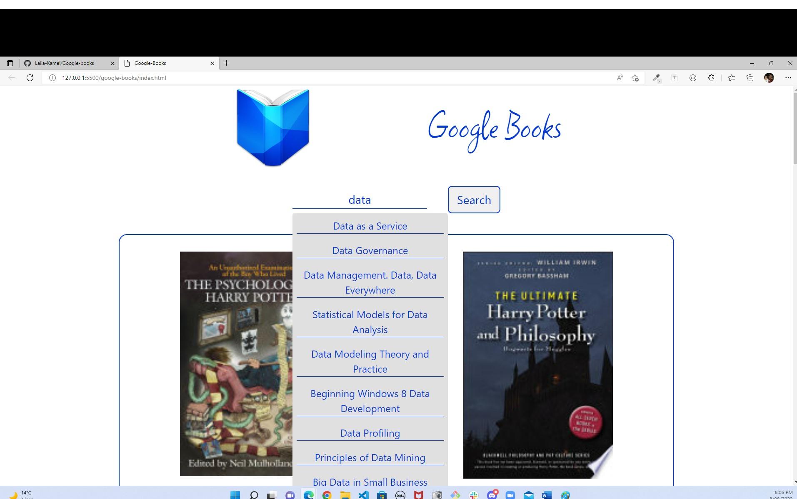

# Google Books API Search Engine

## Image of the application

## Outline

This project uses both DOM manipulation and Asynchronous programming.
The aim of the project is to create an application that allows users to search for books by title inside the Google Books database and to be able to get more details about a certain title.

##  Setup
I used Google Books API to get the books data.
I used bootstrp create a modal for each book that pops up when the user clicks on a book card.

## Description

The main page include the following:

-   Header section with the app logo and name.
-   Form containing a text input and a search button
-   A grid of books

When the user start typing the name of the book title, a dropdown menu with matching titles appears to make it easier for the user to choose the book he wants.
The user can either choose the book from the dropdown menu or write his search query word and click the search button.
After that, a request is sent to the Google books API using the input value as the query string.
The response of the API is rendered in a book grid display.
Each book in the grid has an image, author, title and description.
When the user clicked on a book in the grid, a modal with more information about the book (publisher, Published date, average rating and country) appears.

The grid is responsive on different screen sizes

## Known issues
When typing the search keyword fast, the API couldn't fetch the exact information as the asynchronous function that fetchs the data needs some time. So in order to get the exact matching query string, typing should be slowly.
As a solution for this part, i found using rebouncing will help. So this maybe in the next release.

## Resources:

-   [Google Books API no Auth link](https://developers.google.com/books/docs/v1/using#WorkingVolumes)
-  [bootstrap](https://getbootstrap.com/)
